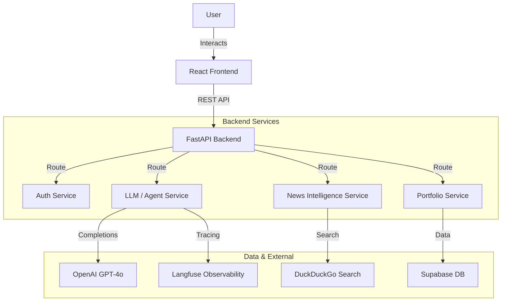

# System Architecture 🏗️

## High-Level Overview

Senhor Finanças follows a **Service-Oriented Architecture (SOA)** with a strict separation between the client (Frontend) and the intelligence layer (Backend). This modular design ensures scalability and allows for independent development of the AI capabilities.

---

## Key Technical Decisions

### 1. Why FastAPI (Backend)?
We chose **FastAPI** over Flask or Django because:
*   **Async Support:** AI operations (LLM calls) are IO-bound. Python's `async/await` allows the server to handle multiple concurrent chats without blocking.
*   **Pydantic Integration:** Ensures strict type validation for all data entering and leaving the system, critical for maintaining data integrity with LLM structured outputs.
*   **Swagger UI:** Automatic documentation made testing endpoints significantly easier during development.

### 2. Why React + Vite (Frontend)?
We moved away from the Streamlit prototype to **React** for several reasons:
*   **User Experience:** Streamlit re-runs the entire script on every interaction, causing lag in chat interfaces. React allows for instant, client-side state updates.
*   **Customization:** Full control over CSS (Tailwind) allowed us to create a "Premium" financial dashboard look that matches professional tools like Bloomberg Terminal or Robinhood.
*   **Scalability:** The frontend is a static asset bundle, deployable to any CDN (Vercel/Netlify), decoupling it from the backend server load.

### 3. Why Supabase?
*   **Speed:** Provides a hosted PostgreSQL database with zero setup.
*   **Auth:** Built-in JWT authentication saved us weeks of building secure login flows.
*   **Realtime:** Future-proofing for live stock price updates via subscriptions.

---

## The AI Agentic Loop 🧠

The core of Senhor Finanças is not a simple chatbot, but an **Autonomous Agent**.

### How it works (`llm_service.py`)

1.  **Context Injection:** When a user sends a message, we verify their portfolio holdings and inject them into the system prompt.
2.  **Tool Selection:** The LLM is provided with a schema of tools:
    *   `search_web`: Checks live events.
    *   `get_stock_price`: Fetches real-time data.
    *   `get_fundamentals`: Looks up P/E ratios, etc.
3.  **Reasoning & Execution:**
    *   The model decides *if* it needs a tool.
    *   **Example:** User asks "Is Tesla a buy?".
    *   **Agent Thought:** "I need current price and news." -> Calls `get_stock_price('TSLA')` and `search_web('Tesla news')`.
    *   **Loop:** The system executes the Python functions and feeds the results back to the LLM.
4.  **Final Synthesis:** The LLM combines the tool outputs into a coherent, professional advice response.

This "Loop" allows the system to answer questions about events that happened *5 minutes ago*, resolving the "Knowledge Cutoff" limitation of standard LLMs.
